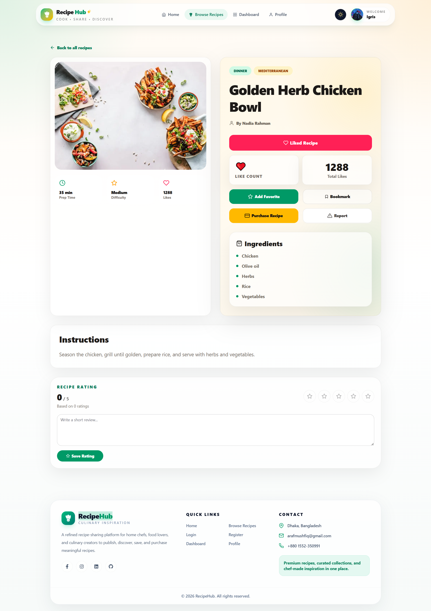
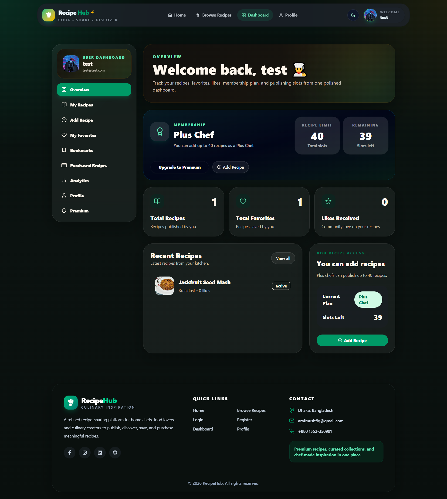
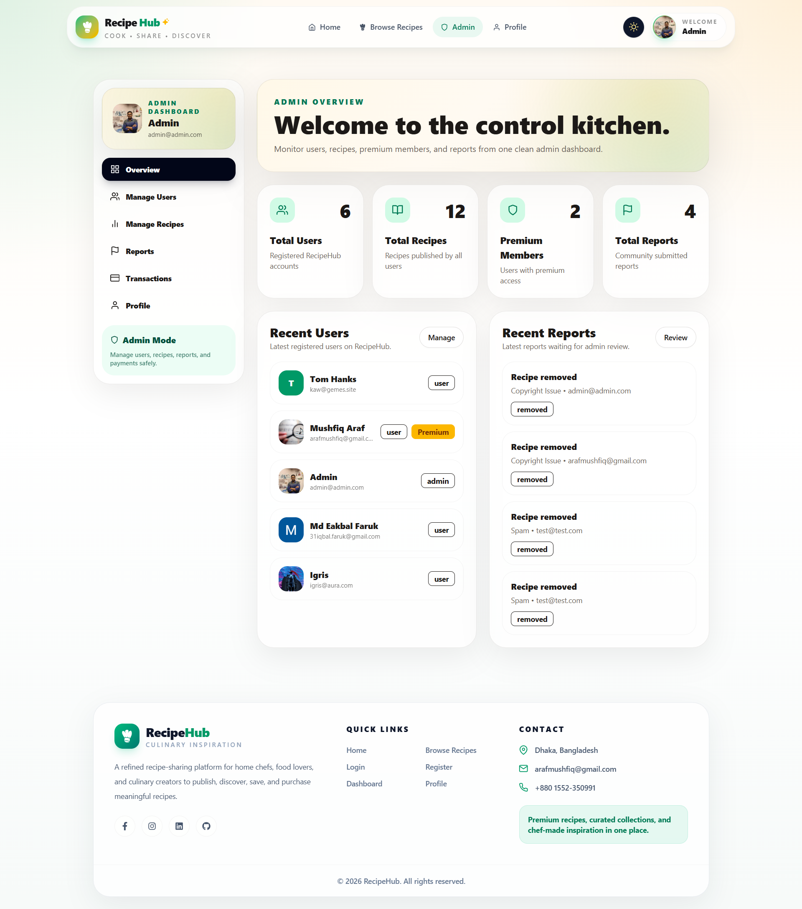
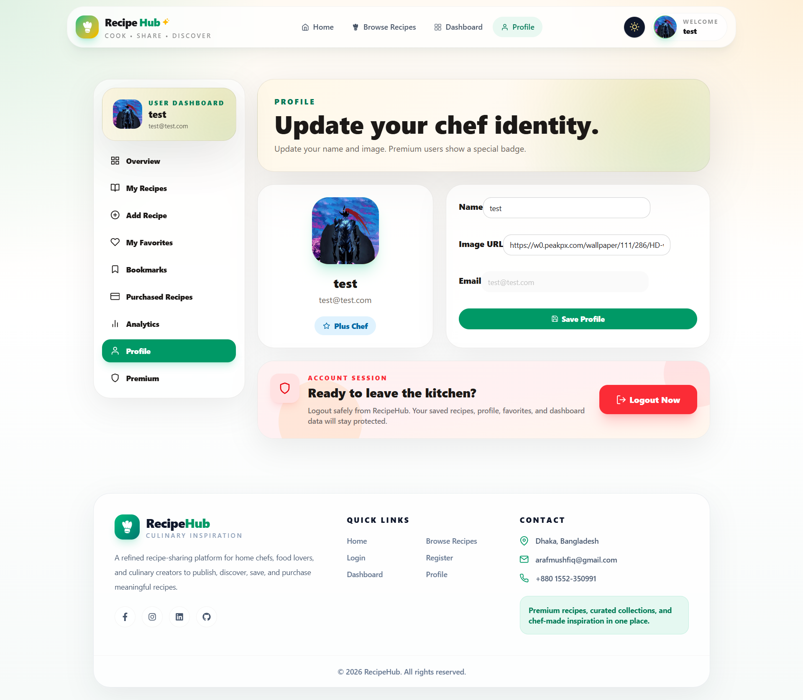
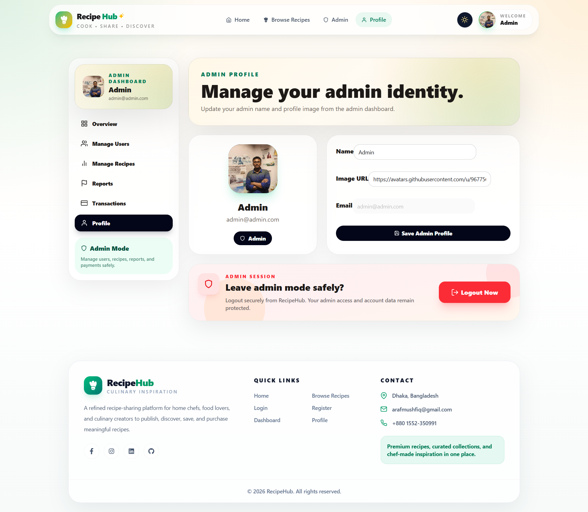

# 🍽️ RecipeHub — Recipe Sharing Platform

A modern recipe sharing platform where food lovers can publish recipes, discover new dishes, save favorites, like recipes, report inappropriate content, and manage their cooking profile from a protected dashboard.

🔗 **Live Site:** [https://recipehub-client-araf.vercel.app](https://recipehub-client-araf.vercel.app/)
🖥️ **Client Repository:** https://github.com/mi-araf/recipehub-client
⚙️ **Server Repository:** https://github.com/mi-araf/recipehub-server

---

## 📌 Project Overview

**RecipeHub** helps users cook, share, and discover recipes from real kitchens. Users can browse community recipes, view full recipe details, register/login, publish their own recipes, like recipes, save favorites, and access a protected user dashboard.

The client is built with **Next.js**, **React**, **Tailwind CSS**, **DaisyUI**, **HeroUI**, and modern animation libraries for a smooth, responsive user experience.

---

## ✨ Key Features

* 🏠 Beautiful landing page with featured sections
* 🔍 Browse recipes with category filtering and pagination
* 📖 Recipe details page with ingredients, instructions, author info, likes, and actions
* 🔐 Email/password authentication
* 🌐 Google social login using Better Auth
* 👤 Protected user dashboard
* ➕ Add recipe with image upload
* 🖼️ Image upload support using ImgBB
* ❤️ Like recipes
* ⭐ Save/remove favorite recipes
* 🚩 Report recipes with predefined reasons
* 🛒 Purchase-ready recipe detail UI
* 👑 Premium-ready recipe publishing limit UI
* 🔥 Toast notifications for success/error feedback
* 📱 Fully responsive design

---

## 🧰 Tech Stack

### Frontend

* **Next.js**
* **React**
* **Tailwind CSS**
* **DaisyUI**
* **HeroUI**
* **Framer Motion**
* **GSAP**
* **Swiper**
* **React Icons**
* **Lucide React**
* **React Hot Toast**

### Authentication & API

* **Better Auth**
* **JWT-based API authentication**
* **Axios / Fetch API**
* **Cookie-based credentials**
* **ImgBB image upload**

### Deployment

* **Vercel**

---

## 📁 Project Structure

```bash
recipehub-client/
├── public/
├── src/
│   ├── app/
│   │   ├── auth/google/callback/
│   │   ├── dashboard/
│   │   │   ├── add-recipe/
│   │   │   └── layout.jsx
│   │   ├── login/
│   │   ├── recipes/
│   │   │   ├── [id]/
│   │   │   └── page.jsx
│   │   ├── register/
│   │   ├── globals.css
│   │   ├── layout.js
│   │   ├── not-found.js
│   │   └── page.js
│   ├── components/
│   │   ├── auth/
│   │   ├── home/
│   │   └── shared/
│   ├── lib/
│   │   ├── api.js
│   │   ├── auth-client.js
│   │   ├── dashboardApi.js
│   │   └── uploadImage.js
│   └── providers/
├── .gitignore
├── eslint.config.mjs
├── jsconfig.json
├── next.config.mjs
├── package.json
├── postcss.config.mjs
└── tailwind.config.js
```

---
## 📸 Project Screenshots

### 🏠 Home Page


---

### 🍲 All Recipes Page


---

### 📖 Recipe Details Page



---

### 👤 User Dashboard



---

---

### 👤 Admin Dashboard



---

### 👤 User Profile



---

---

### 👤 Admin Profile



---

---

## ⚙️ Environment Variables

Create a `.env.local` file in the root directory and add the following variables:

```env
NEXT_PUBLIC_API_URL=http://localhost:5000
NEXT_PUBLIC_AUTH_URL=http://localhost:5000
NEXT_PUBLIC_IMGBB_API_KEY=your_imgbb_api_key_here
```

### Environment Variable Details

| Variable                    | Description                               |
| --------------------------- | ----------------------------------------- |
| `NEXT_PUBLIC_API_URL`       | Backend server base URL                   |
| `NEXT_PUBLIC_AUTH_URL`      | Better Auth server URL                    |
| `NEXT_PUBLIC_IMGBB_API_KEY` | ImgBB API key for uploading recipe images |

For production, use your deployed backend server URL instead of `http://localhost:5000`.

---

## 🚀 Getting Started

### 1. Clone the Repository

```bash
git clone https://github.com/mi-araf/recipehub-client.git
cd recipehub-client
```

### 2. Install Dependencies

```bash
npm install
```

### 3. Configure Environment Variables

Create a `.env.local` file and add your API URL, auth URL, and ImgBB key.

```bash
NEXT_PUBLIC_API_URL=http://localhost:5000
NEXT_PUBLIC_AUTH_URL=http://localhost:5000
NEXT_PUBLIC_IMGBB_API_KEY=your_imgbb_api_key_here
```

### 4. Run the Development Server

```bash
npm run dev
```

Now open:

```bash
http://localhost:3000
```

---

## 📜 Available Scripts

```bash
npm run dev
```

Runs the app in development mode.

```bash
npm run build
```

Builds the app for production.

```bash
npm run start
```

Starts the production server after building.

```bash
npm run lint
```

Runs ESLint to check code quality.

---

## 🔗 Important Routes

| Route                   | Description                    |
| ----------------------- | ------------------------------ |
| `/`                     | Home page                      |
| `/recipes`              | Browse all recipes             |
| `/recipes/:id`          | Recipe details page            |
| `/login`                | User login page                |
| `/register`             | User registration page         |
| `/dashboard`            | Protected dashboard layout     |
| `/dashboard/add-recipe` | Add new recipe page            |
| `/auth/google/callback` | Google authentication callback |

---

## 🔐 Authentication Features

RecipeHub supports:

* Email and password login
* Email and password registration
* Google social login
* Cookie-based authenticated API requests
* Protected dashboard pages
* User session checking
* Logout support

---

## 🧪 Main API Features Used by Client

The client communicates with the backend for:

* User registration
* User login
* Google authentication
* Current user session
* Recipe listing
* Recipe details
* Recipe creation
* Recipe likes
* Favorite toggling
* Report submission
* Dashboard overview
* Recipe publishing limit checking

---

## 🖼️ Image Upload

Recipe images are uploaded through **ImgBB** using the `NEXT_PUBLIC_IMGBB_API_KEY`.

The image upload helper is located at:

```bash
src/lib/uploadImage.js
```

---

## 📱 Responsive Design

The UI is designed to work smoothly across:

* Mobile devices
* Tablets
* Desktop screens

The project uses Tailwind CSS utility classes, DaisyUI components, responsive layouts, and modern card-based sections.

---

## 🧑‍🍳 User Flow

1. User visits the home page.
2. User browses recipes from the community.
3. User can register or login.
4. Authenticated user can access the dashboard.
5. User can publish recipes with image, category, cuisine, difficulty, preparation time, ingredients, and instructions.
6. User can like, favorite, report, or purchase recipes from the recipe details page.

---

## 🚀 Deployment

This client is deployed on **Vercel**.

### Deploy Manually

1. Push your code to GitHub.
2. Go to [Vercel](https://vercel.com/).
3. Import the GitHub repository.
4. Add environment variables.
5. Deploy.

### Required Vercel Environment Variables

```env
NEXT_PUBLIC_API_URL=your_production_backend_url
NEXT_PUBLIC_AUTH_URL=your_production_backend_url
NEXT_PUBLIC_IMGBB_API_KEY=your_imgbb_api_key
```

---

## 🔮 Future Improvements

* Full Stripe payment integration
* Complete premium subscription system
* Recipe editing and deletion
* User profile update
* Advanced search by cuisine, difficulty, time, and creator
* Admin dashboard for reports
* Recipe rating analytics
* Bookmark management page
* Purchased recipe history
* Dark mode polish

---

## 🤝 Contributing

Contributions are welcome!

To contribute:

```bash
git fork
git clone https://github.com/your-username/recipehub-client.git
git checkout -b feature/your-feature-name
git commit -m "Add your feature"
git push origin feature/your-feature-name
```

Then create a pull request.

---

## 👨‍💻 Developer

Developed by **Araf**

* Client: [recipehub-client](https://github.com/mi-araf/recipehub-client)
* Server: [recipehub-server](https://github.com/mi-araf/recipehub-server)

---


---

## ⭐ Show Your Support

If you like this project, give it a star on GitHub and share it with others!
